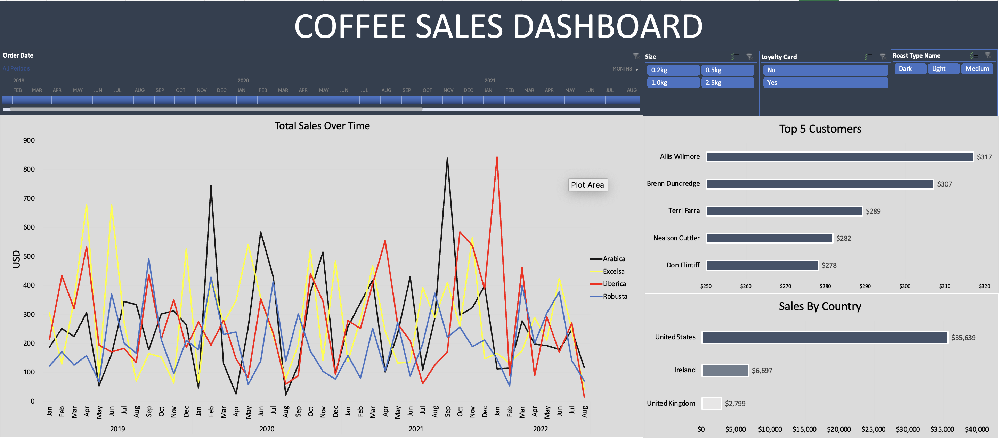

# Coffee Sales Excel Project

### Project Overview

This project

### Data Sources

Coffee Sales data: The primary dataset used for this analysis is the "Coffee Orders Data Full Project.xlsx" file, containing detailed information about each sales made by the company. 

### Tools

- Excel - Data Cleaning, Analysis, Visuialization, and Reporting
- [Download here](https://lccuny-my.sharepoint.com/:x:/g/personal/ali_jabbi_lc_cuny_edu/EaOrhkt5S2lEiRSjQ64pNewBbFTCszjP7dur-7Vp6EEeQA?e=KbfGb1)

### Data Cleaning/Preparation

### Exploratory Data Analysis
- What are the total coffee sales overtime?
- Who's our top 5 customers?
- Sales by country

### Data Analysis

Include interesting code/ formulas

### Results/Findings

### Recommendations

### Limitations
some missing values

#### References
